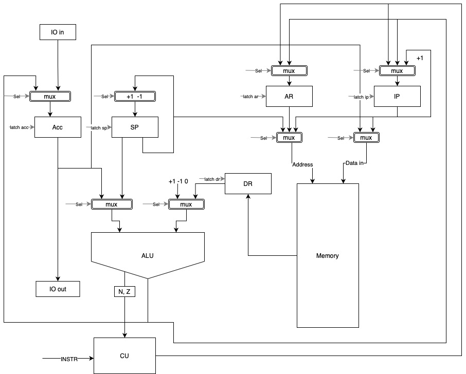

# csa-lab3
 - Арбатова Ксения Владимировна, P3233
 - Вариант: `asm | acc | neum | hw | instr | struct | stream | mem | pstr | prob2 `
 - С упрощением

## Язык программирования

### Синтаксис

#### Форма Бэкуса-Наура

``` enbf
<program> ::=
    ".data" <newline> {<data>} <newline>
    ".instructions" <newline> {<instruction>} <newline> <EOF>
    
<data> ::= <label> ": " <value> [comment] <newline>
<instruction> ::= <operand_address_command> <label>| "$"<number> [comment] <newline> |
                 <operand_command> <label>[comment] <newline> |
                 <no_operand_command> [comment] <newline> 


<no_operand_command> ::= "HLT" | "NOT" | "NEG" | "POP"
<operand_command> ::= "JMP" | "JZ" | "JNZ" | "ST" 
operand_address_command ::= "LD" | "ADD" | "SUB" | "MUL" | "DIV" | "OR" | "AND" | "CMP" | "PUSH"

<value> ::= <number> | "'"<word>"'" 
<label> ::= <word> 

<comment> ::= ";" {<word> | <number>}

<newline> ::= "\n"
<word> ::= <letter> {<letter>}
<number> ::= ["-"]<int> {<int>}
<letter> ::= a | b | c | ... | z | A | B | C | ... | Z
<int> ::= 0 | 1 | 2 | 3 | 4 | 5 | 6 | 7 | 8 | 9
```

#### Объяснение


#### Пример

```asm
.data
A: 1
B: 2
sum: 0

.instructions
    LD A
    ADD B
    ADD $3
    ST sum
    HLT
```

### Семантика


## Организация памяти
Фон Неймановская архитектура, вся память обьединена.

```
            memory
    +-----------------+
    |   JMP TO CODE   |
    +-----------------+
    |   STATIC DATA   |
    |                 |
    |                 |
    +-----------------+
    |      CODE       |
    |                 |
    |                 |
    |                 |
    +-----------------+
    |      STACK      |
    |                 |
    |                 |
    +-----------------+

```
Литералы в статической памяти располагаются в порядке их записи в коде.

Машинное слово - 64 бита, беззнаковое.
Так как архитектура аккумуляторная, программист взаимодействует только с аккумулятор, и команды имеют максимум 1 аргумент.
Поток управления:
- Условный переход (JZ)
- Безусловный переход (JMP)
- Инкремент IP (Instruction Pointer)

## Система команд
Без аргументов:
- HLT - завершение программы
- NOT - логическое НЕ к аккумулятору, 0 -> 1 или !0 -> 0
- NEG - изменить знак аккумулятора, N = !N
- POP - снять значение со стека и записать в ACC
Переход:
- JMP <arg1> - безусловный переход к arg1
- JZ <arg1> - если Z = 1, переход к arg1
- JNZ <arg1> - если Z = 0, переход к arg1
С аргументом:
- LD <arg1> - записать из arg1 в ACC
- ST <arg1> - записать из аккумулятора в arg1
- ADD <arg1> - добавить к ACC arg1
- SUB <arg1> - вычесть из ACC arg1
- MUL <arg1> - умножить ACC на arg1
- DIV <arg1> - делить ACC на arg1
- OR <arg1> - побитовое ИЛИ ACC с arg1
- AND <arg1> - побитовое И ACC с arg1
- CMP <arg1> - Проставить флаги NZ как при операции ACC - arg1
- PUSH <arg1> - Записать значение ACC в стек

### Кодирование команд

 - Команды сериализуются в список JSON
 - Каждая команда представляется объектом с полями:
    - `index` - ячейка памяти
    - `opcode` - код операции. Для записи констант используется `NOP`
    - `value` - значение операнда. Для команд без операндов используется 0
    - `relative` - указывает если команда использует относительный адрес.

Пример сериализации команд:

 - Исходный код:
```asm

```
 - Сериализованный код:
```json

```

## Транслятор

Интерфейс командной строки: `translator.py <source_file> <target_file>`

Правила трансляции:
 - Одна переменная - одна строка. 
 - Одна команда - одна строка. 
 - Метки пишутся в отдельной строке. 
 - Названия секций пишутся в отдельной строке. 
 - Ссылаться можно только на существующие переменные и метки.


## Модель процессора

Интерфейс командной строки: `machine.py <code_file> <input_file>`

### DataPath


Класс `data_path` реализует управление памятью и регистрами процессора.
 
### ControlUnit
Класс `control_unit` реализует управление процессором.
Особенности работы модели:

## Тестирование
 - Тестирование осуществляется при помощи golden test-ов.
 