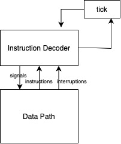

# csa-lab3
 - Арбатова Ксения Владимировна, P3233
 - Вариант: `asm | acc | neum | hw | instr | struct | stream | mem | pstr | prob2 `
 - С упрощением

## Язык программирования

### Синтаксис

#### Форма Бэкуса-Наура

``` enbf
<program> ::=
    ".data" <newline> {<data>} <newline>
    ".instructions" <newline> {<instruction>} <newline> <EOF>
    
<data> ::= <label> ": " <value> [comment] <newline>
<instruction> ::= <operand_address_command> <label>| "$"<number> [comment] <newline> |
                 <operand_command> <label>[comment] <newline> |
                 <no_operand_command> [comment] <newline> 


<no_operand_command> ::= "hlt" | "neg" | "pop" | "ldsp" | "in"| "out" | "ald"
<operand_command> ::= "jmp" | "jz" | "jnz" | "st" | "push"
<operand_address_command> ::= "ld" | "add" | "sub" | "mul" | "div" | "or" | "and" | "cmp" | "push"

<value> ::= <number> | "'"<word>"'" 
<label> ::= <word> 

<comment> ::= ";" {<word> | <number>}

<newline> ::= "\n"
<word> ::= <letter> {<letter>}
<number> ::= ["-"]<int> {<int>}
<letter> ::= a | b | c | ... | z | A | B | C | ... | Z
<int> ::= 0 | 1 | 2 | 3 | 4 | 5 | 6 | 7 | 8 | 9
```

#### Объяснение


#### Пример
Есть две секции, секция данных и инструкций. К данным обращаемся по меткам. Так же, можно загризить число напрямую, используя префикс $.
```asm
.data
A: 1
B: 2
sum: 0

.instructions
    ld A
    add B
    add $3
    st sum
    hlt
```
Резуьтат вычислений будет записан в sum и будет равен 1 + 2 + 3. 

### Семантика
- Видимость данных -- глобальная.
- Поддерживаются целочисленные литералы, находящиеся в диапазоне от $-2^{63}$ до $2^{63}-1$.
- Поддерживаются строковые литералы, символы стоки необходимо заключить в кавычки.
- Код выполняется последовательно.
- Переменные могут быть объявлены только в секции `.data`.
- Переменные и метки не могут повторяться.
- Метки должны быть объявлены только в секции `.instructions` , должны быть на отдельной строке, и должны заканчиватся на  `:`.
- Числа быть записаны в десятичной системе счисления.
- Метки должны быть объявлены до их использования.
- Комментарий - любой текст после `;`.


## Организация памяти
Фон Неймановская архитектура, вся память обьединена.

```
            memory
    +-----------------+
    |   JMP TO CODE   |
    +-----------------+
    |   STATIC DATA   |
    |                 |
    |                 |
    +-----------------+
    |      CODE       |
    |                 |
    |                 |
    |                 |
    +-----------------+
    |      STACK      |
    |                 |
    |                 |
    +-----------------+

```
Литералы в статической памяти располагаются в порядке их записи в коде.

Машинное слово - 64 бита, беззнаковое.
Так как архитектура аккумуляторная, программист взаимодействует только с аккумулятором, и команды имеют максимум 1 аргумент.
Поток управления:
- Условный переход (JZ)
- Безусловный переход (JMP)


- Адресация
- - поддерживается прямая адресация, к примеру `ld $3`  загрузит 3 в аккумулятор
- - поддерживается косвенная адресация, `ld 3` загрузит число в 3ей ячеки памяти
- - поддерживается адресация относительно стек пойнтера, `ld @3` загрузит число в ячеки памяти c индексом `sp + 3`
- - поддерживается косвенная относительная адресация, `ld #3` загрузит число в ячеки памяти c индексом который хранится в ячейке 3.


- Регистры:
- - Аккумулятор (ACC) -- хранит результаты вычислений.
- - Регистр адреса (AR) -- хранит адрес ячейки памяти.
- - Счетчик инструкций (IP) -- хранит адрес следующей инструкции.
- - Регистр данных (DR) -- хранит данные для передачи в память.
- - Указатель стека (SP) -- хранит адрес вершины стека.
- - Регистр состояния (PS) -- хранит флаги состояния процессора в виде битов:
- - - N - флаг отрицательности
- - - Z - флаг нуля

## Система команд
Без аргументов:
- hlt - завершение программы
- not - логическое НЕ к аккумулятору, 0 -> 1 или !0 -> 0
- neg - изменить знак аккумулятора, N = !N
- pop - снять значение со стека и записать в ACC
- in - ввод данных в АСС
- out - вывод данных из АСС

Переход:

- jmp <arg1> - безусловный переход к arg1
- jz <arg1> - если Z = 1, переход к arg1
- jnz <arg1> - если Z = 0, переход к arg1

С аргументом:

- ld <arg1> - записать из arg1 в ACC
- ST <arg1> - записать из аккумулятора в arg1
- add <arg1> - добавить к ACC arg1
- sub <arg1> - вычесть из ACC arg1
- or <arg1> - побитовое ИЛИ ACC с arg1
- and <arg1> - побитовое И ACC с arg1
- cmp <arg1> - Проставить флаги NZ как при операции ACC - arg1
- push <arg1> - Записать значение ACC в стек
- inc <arg1>  - инкрементировать АСС
- dec <arg1>  - декрементировать АСС

### Кодирование команд

 - Команды сериализуются в список JSON
 - Каждая команда представляется объектом с полями:
    - `index` - ячейка памяти
    - `opcode` - код операции. 
    - `arg` - значение операнда. Для команд без операндов используется 0
    - `adr` - указывает, какой вид адресации использует команда.

Пример сериализации команд:

 - Исходный код:
```asm
    .data
        A: 1
        B: 2
        sum: 0

    .instructions
        ld A
        add B
        add $3
        st sum
        hlt

```
 - Сериализованный код:
```json
[{"index": 0, "opcode": "jmp", "arg": 4, "term": [3, 0, "Jump to start"], "adr": "direct"},
 {"index": 1, "arg": 1},
 {"index": 2, "arg": 2},
 {"index": 3, "arg": 0},
 {"index": 4, "opcode": "ld", "arg": 1, "term": [1, 0, "ld A"], "adr": "indirect"},
 {"index": 5, "opcode": "add", "arg": 2, "term": [2, 0, "add B"], "adr": "indirect"},
 {"index": 6, "opcode": "add", "arg": 3, "term": [3, 0, "add $3"], "adr": "direct"},
 {"index": 7, "opcode": "st", "arg": 3, "term": [4, 0, "st sum"], "adr": "indirect"},
 {"index": 8, "opcode": "hlt", "term": [5, 0, "hlt"], "adr": "indirect"}]
```

## Транслятор

Интерфейс командной строки: `translator.py <source_file> <target_file>`

Правила трансляции:
 - Одна переменная - одна строка. 
 - Одна команда - одна строка. 
 - Метки пишутся в отдельной строке. 
 - Названия секций пишутся в отдельной строке. 
 - Ссылаться можно только на существующие переменные и метки.


## Модель процессора

Интерфейс командной строки: `machine.py <code_file> <input_file>`

### DataPath


Класс `data_path` реализует управление памятью и регистрами процессора.
 
### ControlUnit

Класс `control_unit` реализует управление процессором.


## Тестирование
 - Тестирование осуществляется при помощи golden test-ов.
 
Golden тесты:
* [hello world](./golden/hello_world.yml)
* [cat](./golden/cat.yml)
* [hello user](./golden/hello_user.yml)
* [prob2](./golden/prob2.yml)


## Аналитика

```text
| Арбатова Ксения Владимировна  | hello | 1         | -             | 17            | 26       | 224     | asm | acc | neum | hw | instr | struct | stream | mem | pstr | prob2

| Арбатова Ксения Владимировна  | cat   | 4         | -             | 19            | 15       | 84      | asm | acc | neum | hw | instr | struct | stream | mem | pstr | prob2

| Арбатова Ксения Владимировна | prob2 | 15        | -             | 27            | 24      | 674     | asm | acc | neum | hw | instr | struct | stream | mem | pstr | prob2
```
